# Знакомство с Jupyter Notebook в онлайн-среде 

## **Цель:** Научиться работать с Jupyter Notebook, освоить основные функции среды для выполнения кода Python.

### 📌 Шаг 1. Открытие Jupyter Notebook в онлайн-среде
1. Откройте браузер (Google Chrome, Mozilla Firefox, Яндекс.Браузер и т.д.).
2. Перейдите по первой ссылке на официальный сайт [jupyter notebook](https://jupyter.org/) https://jupyter.org/
3. На сайте нажмите кнопку "Try", далее выбираем "Jupyter Lite" чтобы запустить онлайн-версию среды. \

    
    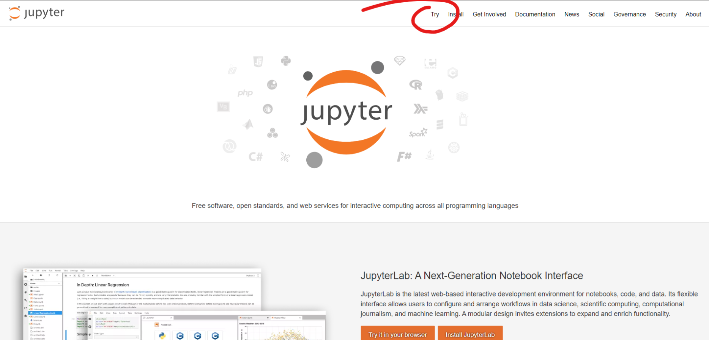
    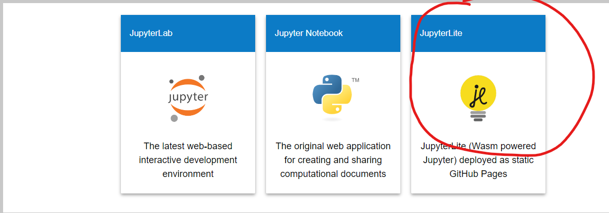

### 📌 Шаг 2. Создание нового блокнота.
1. В панели инструментов выберите пункт 'File' → 'New' → 'Notebook', чтобы создать новый блокнот. \
    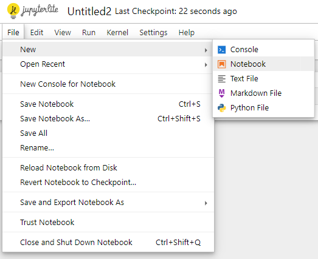
2. Появится всплывающее окно с предложением выбрать ядро (Kernel). Выберите Python (Pyodide), чтобы блокнот мог исполнять Python-код. \
    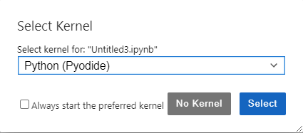
3. Переименуйте блокнот, формат имени: Группа_число_Фамилия_Имя_номер_лабы. Пример: `ST_21_Zhilin_Valentin_1.ipynb` \
    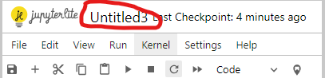 \
    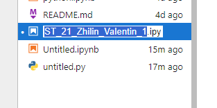

### 📌 Шаг 3. Выполнение простого кода.
1. Введите в первую ячейку блокнота следующий код: 
    ```python
    print("Hello, World!")
    ```
    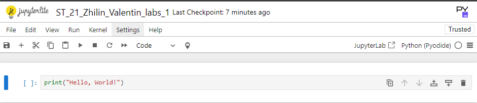
2. Нажмите комбинацию клавиш `Shift + Enter` или кнопку Run (иконка с треугольником) для выполнения кода. \
    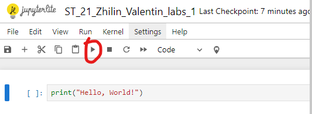
3. Под ячейкой должен появиться результат выполнения программы: \
    

## 📢 Jupyter Guide

### ⚙ Создание новых ячеек
- **Использование панели инструментов:** Нажмите на кнопку `+` в верхней панели. \
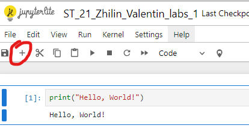 \
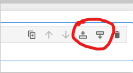 

- **Горячие клавиши:**
    - Нажмите клавишу `B`, находясь в режиме команд, для добавления новой ячейки ниже.
    - Нажмите `A` для добавления новой ячейки выше текущей.
### ⚙ Удаление ячеек
- **Использование панели инструментов:** 
    - Выделите ячейку и нажмите на значок корзины. \
    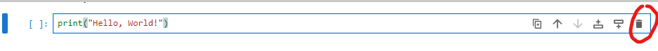
- **Горячие клавиши:**
    - В режиме команд нажмите DD (двойное нажатие клавиши D) для удаления текущей ячейки.

### ⚙ Перемещение ячеек
- **Использование панели инструментов:** Используйте стрелки на панели для перемещения ячеек вверх или вниз. \

- **Горячие клавиши**:
    - `J` — переместить ячейку вниз.
    - `K` — переместить ячейку вверх.

### ⚙ Виды ячеек и их использование
1. Кодовая ячейка
    - **Назначение:** Выполнение Python-кода.
    - **Пример:** \
        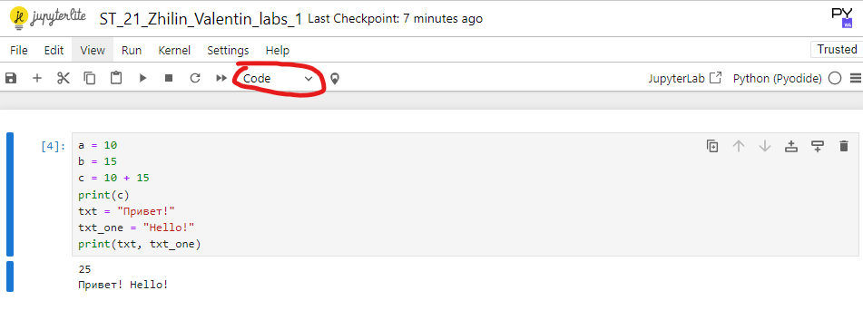
2. Ячейка с текстом (Markdown):
    - **Назначение:** Используется для описания кода, написания документации, добавления заголовков и форматированного текста.
    - **Пример:** \
        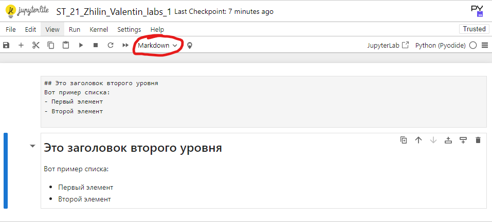
3. Ячейка типа Raw:
    - **Назначение:** Эта ячейка используется для хранения необработанных данных или текста. Она не будет выполнена и не будет форматироваться при выводе. Чаще всего такие ячейки используются для генерации специфичных отчётов или для предварительной обработки данных.
    - **Пример:** \
        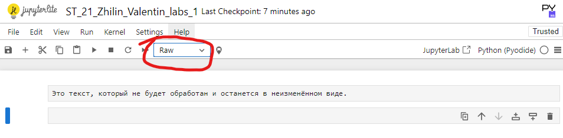

### ⚙ Сохранение блокнота
1. Чтобы сохранить текущий блокнот, нажмите на иконку дискеты в верхней панели или используйте комбинацию клавиш `Ctrl + S`.
2. Для загрузки блокнота на локальный компьютер: \
    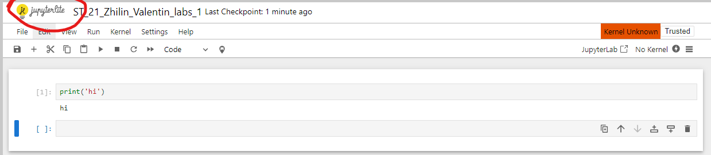

### ⚙ Загрузка и открытие существующих блокнотов
- Для загрузки блокнота в jupyter: \
    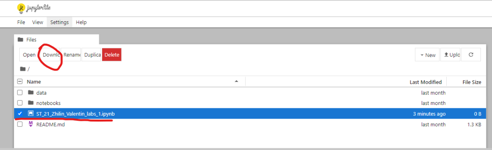 \
    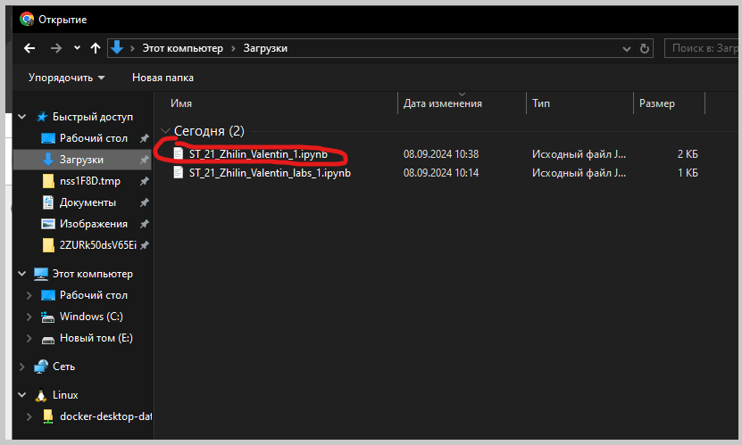
- Для открытия, выбираем загруженный файл:\
    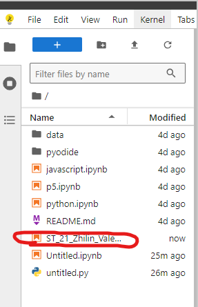

____

[Вернуться на главную страницу](https://valeogamer.github.io/Python_2024_MarSU/)