# Лабораторная работа: Знакомство с Google Colab

## Цель: Научиться работать с Google Colab, освоить основные функции среды для выполнения кода Python.

### 📌 Открытие Google Colab
1. Откройте браузер (Google Chrome, Mozilla Firefox и т.д.).
2. Введите в строке поиска "Google Colab" и перейдите по первой ссылке [google colab](https://colab.research.google.com/) https://colab.research.google.com.
3. Для доступа к Google Colab войдите в свой аккаунт Google. \
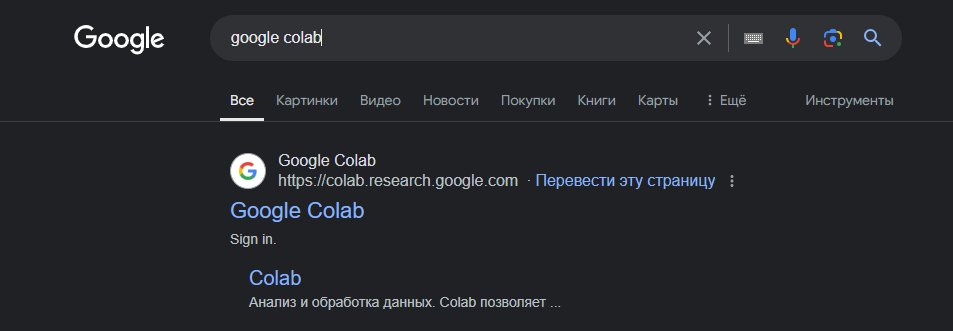
4. На главной странице нажмите на кнопку "Создать блокнот" для создания нового блокнота.
5. Переименуйте блокнот, формат имени: Группа_число_Фамилия_Имя_номер_лабы. Пример: `ST_21_Zhilin_Valentin_1.ipynb` \
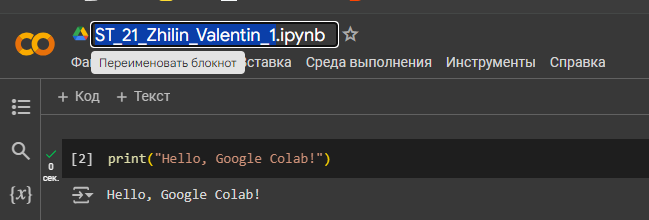

### 📌 Интерфейс Google Colab
1. Перед вами откроется пустой блокнот Google Colab с одной ячейкой для кода.
2. Верхняя панель инструментов включает такие элементы, как Файл, Изменить, Вид, Вставка, Среда выполнения, Инструменты, Справка где можно выполнить различные действия с блокнотом. \

3. Каждая ячейка может быть текстовой (Markdown) или кодовой. \
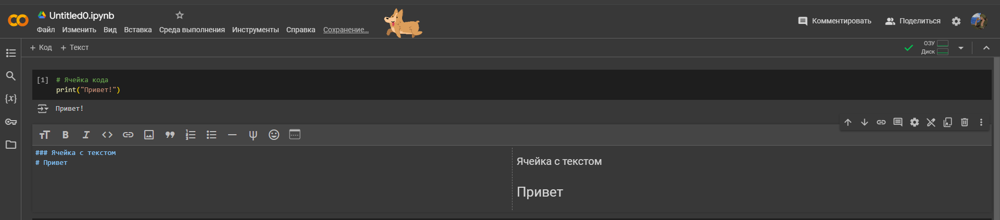

### 📌 Выполнение простого кода (Кодовая ячейка)
1. Добавьте новую ячейку, нажав на кнопку `+Код`: \

2. Введите в первую ячейку блокнота следующий код: \
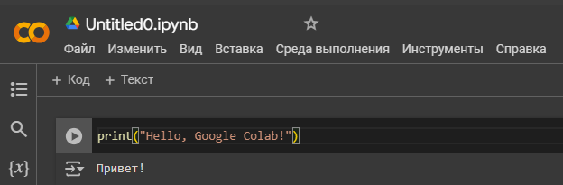
3. Для выполнения кода нажмите на кнопку Play (иконка с треугольником) или комбинацию клавиш `Shift + Enter.` \
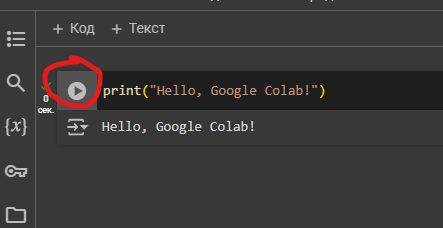
4. Под ячейкой должен появиться результат: \
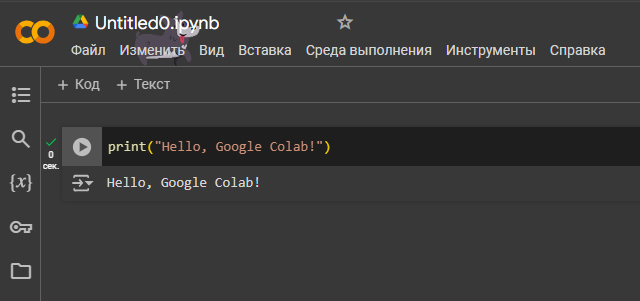

### 📌 Работа с текстовыми ячейками
1. Добавьте новую ячейку, нажав на кнопку `+Текст`: \
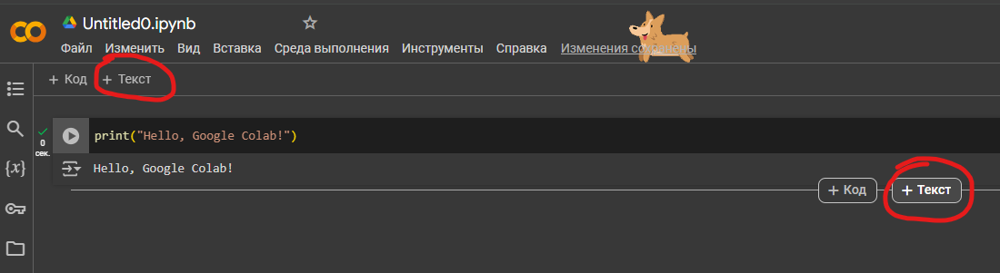      
2. Введите следующий текст в формате Markdown:
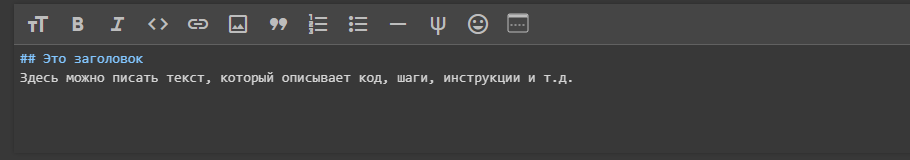
3. Выполните текстовую ячейку с помощью `Shift + Enter`, и увидите отформатированный текст.

### 📌 Создание новых ячеек
1. Использование панели инструментов:
- Нажмите кнопку `+Код` в верхней части экрана, чтобы добавить ячейку или наведите стрелку на нижнюю границу ячейки чтобы получить всплывающуюся подсказку и тоже нажать `+Код`. \
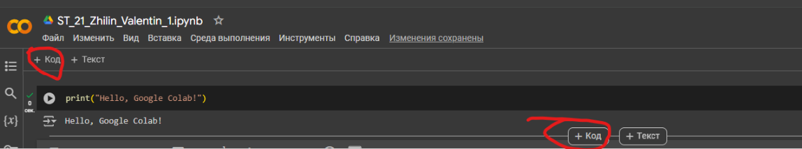
2. Горячие клавиши:
- Нажмите `Ctrl + M + B` для добавления новой ячейки ниже.
- Нажмите `Ctrl + M + A` для добавления новой ячейки выше текущей.

### 📌 Удаление ячеек
1. Использование панели инструментов:
- Выделите ячейку и нажмите на значок корзины, чтобы удалить её. \
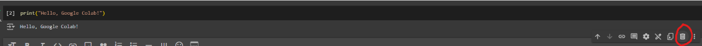
2. Горячие клавиши:
- Нажмите `Ctrl + M + D` для удаления выбранной ячейки.

### 📌 Перемещение ячеек
1. Использование панели инструментов:
Используйте стрелки в верхней части экрана для перемещения ячеек вверх или вниз.
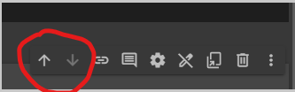
2. Горячие клавиши:
Нажмите `Ctrl + M + K` для перемещения ячейки вверх.
Нажмите `Ctrl + M + J` для перемещения ячейки вниз.

### 📌 Типы ячеек
1. Кодовая ячейка: Используется для выполнения Python-кода.
- Пример:
```python
    x = 5
    print(x)
```
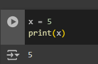 \
2. Ячейка с текстом (Markdown):
Используется для форматированного текста, заголовков и пояснений.
- Пример:
```markdown
    ### Заголовок
    Это пример текстовой ячейки.
```
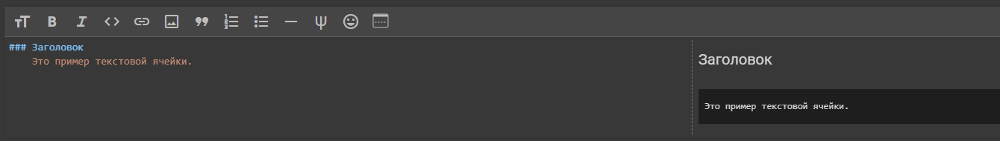

### 📌 Сохранение и загрузка блокнота
1. Сохранение:
    - Блокнот создается и сохранятеся автоматически в google drive.
    - Изменения автоматически сохраняются после выполнения ячейки.
    - Сохранение можно исполнить сочетанием клавиш: `ctrl + s`
    - Расположение текущего блокнота: \
    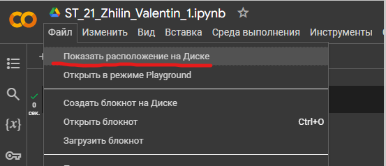
2. Загрузка блокнота на свой компьютер: \
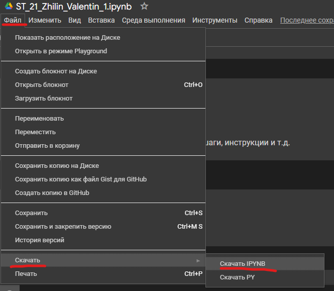

### 📌 Загрузка существующего блокнота
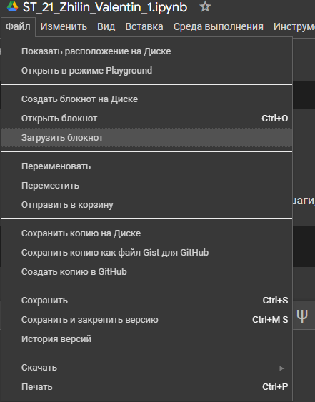 \
 \
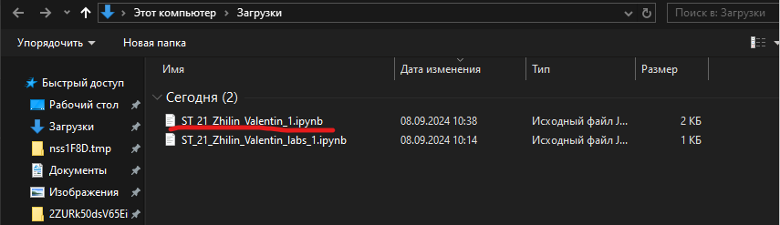
____
[Вернуться на главную страницу](https://valeogamer.github.io/Python_2024_MarSU/)