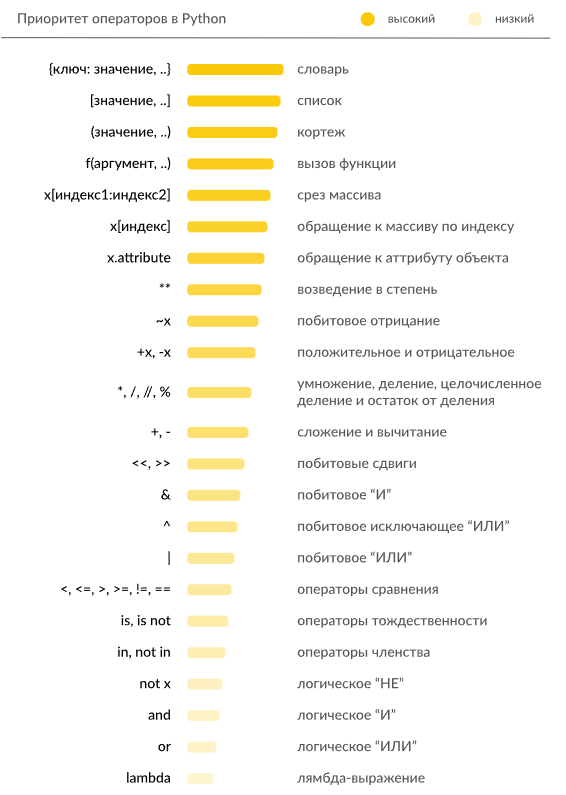

# Лабораторная работа №4: Условный оператор

## Цель: Научиться использовать условные операторы в Python для управления потоком выполнения программы.

###  Логический тип данных 
В Python логический тип данных представлен типом `bool`. Он может принимать два значения: `True (истина)` и `False (ложь)`. Логические значения часто используются в условиях для принятия решений.

```python
    # Примеры логических значений
    is_sunny = True
    is_raining = False

    # Вывод значений
    print(is_sunny)  # Выведет: True
    print(is_raining)  # Выведет: False
```
#### Применение в программировании
Логические значения часто используются в условных операторах для принятия решений. **Например:**
```python
    # Пример использования логических значений в условии
    is_sunny = True

    if is_sunny: # Если солнечно
        print("Сегодня солнечно, наденьте солнечные очки.")
    else: # Иначе не солнечно
        print("Сегодня не солнечно, возьмите зонт.")
```
**Объяснение:**
- `if is_sunny:`: Проверяет, является ли значение переменной is_sunny истинным (True). Если да, выполняется блок кода внутри if.
- `else:`: Если условие в if не выполняется (т.е. is_sunny равно False), выполняется блок кода внутри else.

#### Преобразование в логический тип
В Python можно преобразовать другие типы данных в логический тип с помощью функции `bool()`.
```python
    print(bool(1))  # Выведет: True
    print(bool(0))  # Выведет: False
    print(bool("Hello"))  # Выведет: True
    print(bool(""))  # Выведет: False
```
**Объяснение:**
- `bool(1)`: *Любое ненулевое число преобразуется в True.*
- `bool(0)`: *Ноль преобразуется в False.*
- `bool("Hello")`: *Любая непустая строка преобразуется в True.*
- `bool("")`: *Пустая строка преобразуется в False.*

###  Таблица истинности
Таблица истинности показывает результаты логических операций для всех возможных комбинаций входных значений.

| A | B |A and B|A or B|not A|not B|
|---|---|---|---|---|---|
|True|  True|   True|   True    |False| False|
|True|	False|	False|	True	|False|True|
|False|	True|	False|	True	|True|False|
|False|	False|	False|	False	|True|True|

- Представим что `1 (истина)`, на самом деле в python если преобразовать любое число отличающеся от `0` в `bool`, то получим `True`.
- Представим что `0 (ложь)`
- `and` - это операция `* (умножение)`
- `or` - это операция `+ (сложения)`
- `not` - это `отрицание`

Тогда таблица истинности с алгебраическими обозначениями

| A | B | A * B | A + B | не A | не B |
|---|---|---|---|---|---|
| 1 | 1 | 1 | 1 | 0 | 0 |
| 1 | 0 | 0 | 1 | 1 | 1 |
| 0 | 1 | 0 | 1 | 1 | 0 |
| 0 | 0 | 0 | 0 | 1 | 1 |

**Объяснение**\
`A and B == (A * B)`: Результат равен 1 только если оба A и B равны 1. В остальных случаях результат равен 0.
```python
    A = True
    B = True
    if A and B: # если A и B истина
        print('A и B истина')
    else: # иначе либо A ложь, либо B ложь, либо A и B ложь
        print('Ложь')
```

`A or B == (A + B)`: Результат равен 1, если хотя бы один из A или B равен 1. Результат равен 0 только если оба A и B равны 0.
```python
    A = True
    B = False
    if A or B: # если A или B истина
        print('A или B истина')
    else: # иначе A и B ложь
        print('Ложь')
```

`not A`: Результат равен 1, если A равно 0, и равен 0, если A равно 1.
```python
    A = True
    B = False
    
    if not A: # если A не истина, значит A ложь
        print('A - ложь')
    else: # иначе A - истина
        print('A - истина')
    
    if not B: # если B не ложь, значит B истина
        print('B - истина')
    else: # иначе B - ложь
        print('B - ложь')
```

###  Логические операции `OR`, `AND`, `NOT`
- `or (логическое ИЛИ)`: Возвращает True, если хотя бы одно из условий истинно.
- `and (логическое И)`: Возвращает True, если оба условия истинны.
- `not (логическое НЕ)`: Возвращает противоположное значение условия.

```python
    a = True
    b = False

    result_or = a or b  # True
    result_and = a and b  # False
    result_not = not a  # False`
```

#### Логическая операция `OR`
Операция `OR` возвращает True, <u>если хотя бы одно из условий истинно.</u>
```python
    # Пример использования OR
    A = True
    B = False

    result_or = A or B  # True, так как хотя бы одно из условий истинно
    print(result_or)  # Выведет: True

    # Комментарий:
    # Здесь A = True и B = False.
    # Операция A or B вернет True, так как хотя бы одно из условий (A) истинно.
```

#### Логическая операция `AND`
Операция `AND` <u>возвращает True</u>, только <u>если оба условия истинны</u>.

```python
    # Пример использования AND
    A = True
    B = False

    result_and = A and B  # False, так как оба условия не истинны
    print(result_and)  # Выведет: False

    # Комментарий:
    # Здесь A = True и B = False.
    # Операция A and B вернет False, так как оба условия не истинны (B = False).
```

#### Логическая операция `NOT`
Операция `NOT` возвращает противоположное значение условия.

```python
    # Пример использования NOT
    A = True

    result_not = not A  # False, так как A истинно
    print(result_not)  # Выведет: False

    # Комментарий:
    # Здесь A = True.
    # Операция not A вернет False, так как A истинно.
```

#### Прмиеры применения
Логические операции часто используются в условных операторах для принятия решений.

**Пример с `OR`:**
```python
    # Пример использования OR в условии
    x = 5
    y = 10

    if x > 0 or y > 0:
        print("Хотя бы одно число положительное")
    else:
        print("Оба числа не положительные")

    # Комментарий:
    # Здесь x = 5 и y = 10.
    # Операция x > 0 or y > 0 вернет True, так как хотя бы одно из условий (x > 0) истинно.
    # Поэтому будет выведено "Хотя бы одно число положительное".
```

**Пример с `AND`:**
```python
    # Пример использования AND в условии
    x = 5
    y = 10

    if x > 0 and y > 0:
        print("Оба числа положительные")
    else:
        print("Хотя бы одно число не положительное")

    # Комментарий:
    # Здесь x = 5 и y = 10.
    # Операция x > 0 and y > 0 вернет True, так как оба условия истинны.
    # Поэтому будет выведено "Оба числа положительные".
```

**Прмиер с `NOT`:**
```python
    # Пример использования NOT в условии
    x = 5

    if not x > 0:
        print("Число x не положительное")
    else:
        print("Число x положительное")

    # Комментарий:
    # Здесь x = 5.
    # Операция x > 0 вернет True, так как x положительное.
    # Операция not x > 0 вернет False, так как x > 0 истинно.
    # Поэтому будет выведено "Число x положительное".
```

###  Операторы сравнения
Операторы сравнения используются для сравнения значений. Результатом сравнения является логическое значение `(True или False)`.
- `==` (равно)
- `!=` (не равно)
- `>` (больше)
- `<` (меньше)
- `>=` (больше или равно)
- `<=` (меньше или равно)

```python
    x = 5
    y = 10

    is_equal = x == y  # False
    is_not_equal = x != y  # True
    is_greater = x > y  # False
    is_less = x < y  # True
    a = 'abc'
    a == 'abc' # True
    b = 'abc'
    a == b  # True
    c=b
    a == c  # True
```

#### Оператор `==` (равно)
Оператор `==` проверяет, равны ли два значения.
```python
    # Пример использования ==
    x = 5
    y = 5

    result_equal = x == y  # True, так как x и y равны
    print(result_equal)  # Выведет: True

    # Комментарий:
    # Здесь x = 5 и y = 5.
    # Операция x == y вернет True, так как значения x и y равны.
```

#### Оператор `!=` (не равно)
Оператор `!=` проверяет, не равны ли два значения.
```python
    # Пример использования !=
    x = 5
    y = 10

    result_not_equal = x != y  # True, так как x и y не равны
    print(result_not_equal)  # Выведет: True

    # Комментарий:
    # Здесь x = 5 и y = 10.
    # Операция x != y вернет True, так как значения x и y не равны.
```

#### Оператор `>` (больше)
Оператор `>` проверяет, больше ли первое значение, чем второе.
```python
    # Пример использования >
    x = 10
    y = 5

    result_greater = x > y  # True, так как x больше y
    print(result_greater)  # Выведет: True

    # Комментарий:
    # Здесь x = 10 и y = 5.
    # Операция x > y вернет True, так как x больше y.
```

#### Оператор `<` (меньше)
Оператор `<` проверяет, меньше ли первое значение, чем второе.
```python
    # Пример использования <
    x = 5
    y = 10

    result_less = x < y  # True, так как x меньше y
    print(result_less)  # Выведет: True

    # Комментарий:
    # Здесь x = 5 и y = 10.
    # Операция x < y вернет True, так как x меньше y.
```

#### Оператор `>=` (больше или равно)
Оператор `>=` проверяет, больше ли первое значение, чем второе, или равно ему.
```python
    # Пример использования >=
    x = 10
    y = 10

    result_greater_equal = x >= y  # True, так как x равно y
    print(result_greater_equal)  # Выведет: True

    # Комментарий:
    # Здесь x = 10 и y = 10.
    # Операция x >= y вернет True, так как x равно y.
```

#### Оператор `<=` (меньше или равно)
Оператор `<=` проверяет, меньше ли первое значение, чем второе, или равно ему.
```python
    # Пример использования <=
    x = 5
    y = 10

    result_less_equal = x <= y  # True, так как x меньше y
    print(result_less_equal)  # Выведет: True

    # Комментарий:
    # Здесь x = 5 и y = 10.
    # Операция x <= y вернет True, так как x меньше y.
```

#### Пример
```python
    # Пример использования операторов сравнения в условии
    x = 5
    y = 10

    if x == y:
        print("x равно y")
    elif x > y:
        print("x больше y")
    else:
        print("x меньше y")

    # Комментарий:
    # Здесь x = 5 и y = 10.
    # Операция x == y вернет False, так как x не равно y.
    # Операция x > y вернет False, так как x не больше y.
    # Поэтому будет выведено "x меньше y".
```

###  Оператор `in`
Оператор `in` используется для проверки наличия элемента в последовательности (например, в списке, строке, кортеже).

```python
my_list = [1, 2, 3, 4]
is_in_list = 3 in my_list  # True
is_not_in_list = 5 in my_list  # False
txt = "Hello, world"
if "world" in txt: # если слово "word" содержится в строоке txt
    print(f'слово "word" содержится в строке {txt}.')
else:
    print(f'txt не содержит слово "word".')
```

###  Условный оператор `if`, `elif`, `else`
Условный оператор позволяет выполнять различные блоки кода в зависимости от условия.
- `if` **(если)**: Выполняет блок кода, если условие истинно.
- `elif` **(иначе если)**: Проверяет следующее условие, если предыдущее ложно.
- `else` **(иначе)**: Выполняет блок кода, если все предыдущие условия ложны.

```python
    if условие:
        # выполняется этот блок кода, если условие истинно (True)
    elif другое_условие:
        # выполняется этот блок кода, если первое условие ложно, но это условие истинно
    elif другое_условие:
        # выполняется этот блок кода, если второе условие ложно, но это условие истинно
    elif другое_условие:
        # выполняется этот блок кода, если третье условие ложно, но это условие истинно
    else:
        # выполняется этот блок кода, если все предыдущие условия ложны
```

#### Пример использования
Пример с использованием логических операторов
```python
    age = int(input("Введите ваш возраст: "))

    if age < 18:
        print("Вы еще подросток.")
    elif 18 <= age < 65:
        print("Вы взрослый человек.")
    else:
        print("Вы пенсионер.")
```
Пример с использованием логических операторов
```python
    age = int(input("Введите ваш возраст: "))
    is_student = input("Вы студент? (да/нет): ").lower() == "да"

    # Использование and
    if age >= 18 and age < 65:
        print("Вы взрослый человек.")
    else:
        print("Вы либо подросток, либо пенсионер.")

    # Использование or
    if age < 18 or age >= 65:
        print("Вам предоставляется льгота.")
    else:
        print("Льготы не предоставляются.")

    # Использование not
    if not is_student:
        print("Полная стоимость билета.")
    else:
        print("Скидка на билет для студентов.")
```
Пример с использованием оператора `in`
```python
    my_list = [1, 2, 3, 4, 5]
    my_string = "Hello, Python!"

    # Проверка наличия элемента в списке
    if 3 in my_list:
        print("Число 3 есть в списке.")
    else:
        print("Числа 3 нет в списке.")

    # Проверка наличия подстроки в строке
    if "Python" in my_string:
        print("Подстрока 'Python' найдена.")
    else:
        print("Подстрока 'Python' не найдена.")
```

### Приоритет операторов в Python 


##  Лабораторная работа 

###  Задача 1. Проверка числа. 
**Задание:** Напишите программу, которая запрашивает у пользователя целое число и выводит на экран:
- "Положительное", если число больше нуля.
- "Отрицательное", если число меньше нуля.
- "Ноль", если число равно нулю.

Шаги:
- Запросить у пользователя целое число.
- Использовать условный оператор if-elif-else для проверки значения числа.
- Вывести соответствующее сообщение на экран.
 
###  Задача 2. Проверка возраста для покупки алкоголя
**Задание:**
Напишите программу, которая запрашивает у пользователя его возраст и проверяет, разрешено ли ему покупать алкоголь. Если возраст меньше 18 лет, программа должна вывести сообщение "Покупка алкоголя запрещена". В противном случае, программа должна вывести сообщение "Покупка алкоголя разрешена".

###  Задача 3. Четное или нечетное.
**Задание:** Напишите программу, которая запрашивает у пользователя целое число и определяет, является ли оно четным или нечетным.

Шаги:
- Запросить у пользователя целое число.
- Вывести соответствующее сообщение на экран.

###  Задача 4. Проверка пароля.
**Задание:** Напишите программу, которая запрашивает у пользователя пароль и сравнивает его с заранее заданным паролем. Если пароли совпадают, программа выводит "Доступ разрешен", в противном случае - "Доступ запрещен".

Шаги:
- Задать заранее известный пароль.
- Запросить у пользователя пароль.
- Вывести соответствующее сообщение на экран.

###  Задача 5. Калькулятор.
**Задание:** Напишите программу-калькулятор, которая запрашивает у пользователя два числа и операцию (+, -, *, /). В зависимости от выбранной операции, программа должна выполнить соответствующее действие и вывести результат.

Шаги:
- Запросить у пользователя два числа и операцию.
- Использовать вложенные условные операторы if-elif-else для выбора операции.
- Выполнить выбранную операцию и вывести результат на экран.

###  Задача 6. Определение времени года.
**Задание:** Напишите программу, которая запрашивает у пользователя номер месяца (от 1 до 12) и выводит на экран соответствующее время года (зима, весна, лето, осень).

Шаги:
- Запросить у пользователя номер месяца.
- Использовать условный оператор if-elif-else для определения времени года по номеру месяца.
- Вывести соответствующее время года на экран.

###
___

[Вернуться на главную страницу](https://valeogamer.github.io/Python_2024_MarSU/)